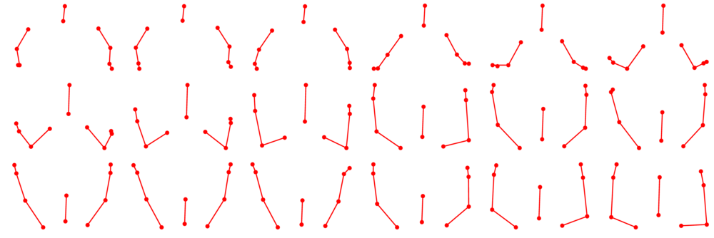
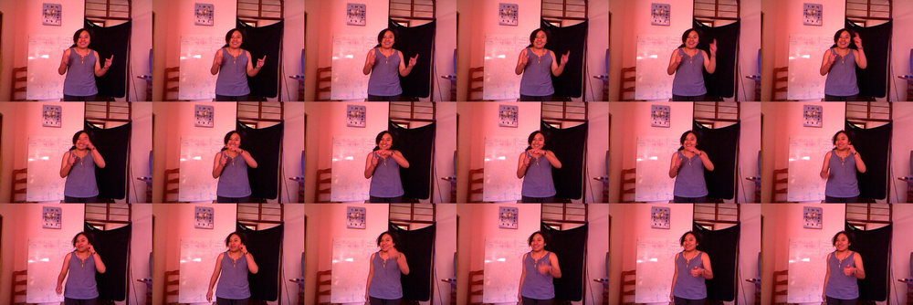
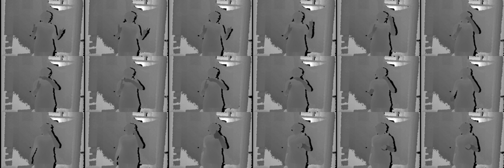
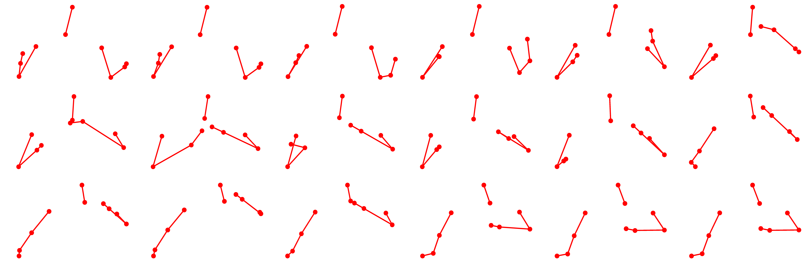
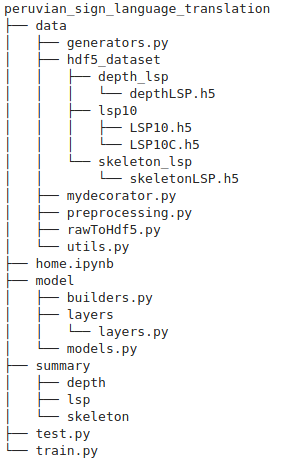

<h1>
VideoLSP10
</h1>
The sign dataset for Peruvian Sign Language  was created with the objective of encouraging students and researchers to find better solutions to reduce the gap that exists between the deaf community and normal people, also to be used as training data for different learning models this dataset include 3 dataset called depthLSP, skeletonLSP10 and LSP10.  
<a href="https://drive.google.com/drive/folders/1Bx3vP_ATx6DMBKhIUSh_3hocAAoNa6i6?usp=sharing">You can download VideoLSP10 dataset here</a>

## DepthLSP
This dataset contains depth frames divided into 14 classes, it was obtained by the Kinect sensor v1 at a resolution of 480x640 in closed environments. Each depth frame has both hands in different positions according to the label.

    <table>
  <tr>
    <th>Nro</th>
    <th>Label</th>
    <th>#Images</th>
     <th>Nro</th>
    <th>Label</th>
    <th>#Images</th>
  </tr>
  <tr>
    <td>1</td>
    <td>pos1</td>
    <td>173</td>
    <td>8</td>
    <td>pos8</td>
    <td>96</td>
  </tr>
  <tr>
    <td>2</td>
    <td>pos2</td>
    <td>210</td>
    <td>9</td>
    <td>pos9</td>
    <td>152</td>
  </tr>
  <tr>
    <td>3</td>
    <td>pos3</td>
    <td>160</td>
    <td>10</td>
    <td>pos10</td>
    <td>99</td>
  </tr>
  <tr>
    <td>4</td>
    <td>pos4</td>
    <td>60</td>
    <td>11</td>
    <td>pos11</td>
    <td>135</td>
  </tr>
  <tr>
    <td>5</td>
    <td>pos5</td>
    <td>185</td>
    <td>12</td>
    <td>pos12</td>
    <td>230</td>
  </tr>
  <tr>
    <td>6</td>
    <td>pos6</td>
    <td>152</td>
    <td>13</td>
    <td>pos13</td>
    <td>99</td>
  </tr>
  <tr>
    <td>7</td>
    <td>pos7</td>
    <td>195</td>
    <td>14</td>
    <td>pos14</td>
    <td>99</td>
  </tr>
    <tr>
        <td colspan="4" style="text-align:center">TOTAL</td>
    <td>-</td>
    <td>2045</td>
  </tr>
</table>

<h3>
<strong>Samples:</strong>
</h3>
 

  

      

          
      

      pos9
  

  

     

          
      

      pos12
  

  

     

          
      

      pos2
  

 
<a href="https://drive.google.com/open?id=1ll9QGjXHGcWHlFhK_F_1FPy6y0vy1uOc">Download depthLSP from Google drive</a>

## SkeletonLSP

This dataset contains 1701 skeleton movements that are divided into 21 classes and each class has 81 sequences of movement where each frame from movement is composed of 10 coordinates (<strong>x, y, z</strong>) where each one represents points of union of the upper body (hand right, wrist right, elbow right, shoulder right, head, shoulder center, shoulder left, elbow left, wrist left and hand left). The character <strong>"l"</strong> (left hand), <strong>"r"</strong> (right hand) and <strong>"b"</strong> (both hands) are prefixed to each tag as a reference to the hand that executes an action or movement. The movements are directed to certain directions (up, front, left, right, head, mouth and chest).

    <table>
  <tr>
    <th>Nro</th>
    <th>Label</th>
    <th>#Videos</th>
     <th>Nro</th>
    <th>Label</th>
    <th>#Videos</th>
  </tr>
  <tr>
    <td>1</td>
    <td>l-up</td>
    <td>81</td>
    <td>11</td>
    <td>r-right</td>
    <td>81</td>
  </tr>
  <tr>
    <td>2</td>
    <td>r-up</td>
    <td>81</td>
    <td>12</td>
    <td>b-right</td>
    <td>81</td>
  </tr>
  <tr>
    <td>3</td>
    <td>b-up</td>
    <td>81</td>
    <td>13</td>
    <td>l-head </td>
    <td>81</td>
  </tr>
  <tr>
    <td>4</td>
    <td>l-front</td>
    <td>81</td>
    <td>14</td>
    <td>r-head</td>
    <td>81</td>
  </tr>
  <tr>
    <td>5</td>
    <td>r-front</td>
    <td>81</td>
    <td>15</td>
    <td>b-head</td>
    <td>81</td>
  </tr>
  <tr>
    <td>6</td>
    <td>b-front</td>
    <td>81</td>
    <td>16</td>
    <td>l-mouth</td>
    <td>81</td>
  </tr>
  <tr>
    <td>7</td>
    <td>l-left</td>
    <td>81</td>
    <td>17</td>
    <td>r-mouth</td>
    <td>81</td>
  </tr>
  <tr>
    <td>8</td>
    <td>r-left</td>
    <td>81</td>
    <td>18</td>
    <td>b-mouth</td>
    <td>81</td>
  </tr>
  <tr>
    <td>9</td>
    <td>b-left </td>
    <td>81</td>
    <td>19</td>
    <td>l-chest</td>
    <td>81</td>
  </tr>
  <tr>
    <td>10</td>
    <td>l-right</td>
    <td>81</td>
    <td>20</td>
    <td>r-chest</td>
    <td>81</td>
  </tr>
  <tr>
    <td>11</td>
    <td>b-chest</td>
    <td>81</td>
    <td>-</td>
    <td>-</td>
    <td>-</td>
  </tr>
  <tr>
    <td colspan="4" style="text-align:center">TOTAL</td>
    <td>-</td>
    <td>1701</td>
  </tr>
</table>

<h3>
<strong>sample sequence:</strong>
</h3>  

  

      

          
      

      b-up
  

<a href="https://drive.google.com/open?id=1ZP4vaRWslEalqQF8TsWiYI7DpiCOOyd1">Download skeletonLSP from Google drive</a> 

## LSP10

This data set contains 10 Peruvian phrases most used in daily life and selected according to our criteria. there are 60 videos from each one split on <strong>rgb</strong>, <strong>depth</strong> and <strong>skeleton</strong> format moreover them was captured in different environments with natural light, artificial and with different intensities. The number of frames from one phrase oscillate in range of 17 to 197 depending on the gesture complexity. Recorded data was made to 25 individuals who were taught each phrase before recording. Dataset LSP10 was recorded using the Kinect sensor v1 where the resolution recorded for rgb and depth data were <strong>480 x 640</strong> and skeleton data have 10 union points such as  (hand right, wrist right, elbow right, shoulder right, head, shoulder center, shoulder left, elbow left, wrist left, hand left).

    <table>
  <tr>
    <th style="text-align:center">Nro</th>
    <th style="text-align:center">Label</th>
    <th style="text-align:center">#Videos</th>
  </tr>
  <tr>
    <td>1</td>
    <td style="text-align:center">Help me</td>
    <td>60</td>
  </tr>
  <tr>
    <td>2</td>
    <td style="text-align:center">Please</td>
    <td>60</td>
  </tr>
  <tr>
    <td>3</td>
    <td style="text-align:center">I am sorry </td>
    <td>60</td>
  </tr>
  <tr>
    <td>4</td>
    <td style="text-align:center">¿What are your name?</td>
    <td>60</td>
  </tr>
  <tr>
    <td>5</td>
    <td style="text-align:center">I do not understand</td>
    <td>60</td>
  </tr>
  <tr>
    <td>6</td>
    <td style="text-align:center">¿Where do you live?</td>
    <td>60</td>
  </tr>
  <tr>
    <td>7</td>
    <td style="text-align:center">¿What are you do?</td>
    <td>60</td>
  </tr>
  <tr>
    <td>8</td>
    <td style="text-align:center">Hello, ¿How are you?</td>
    <td>60</td>
  </tr>
  <tr>
    <td>9</td>
    <td style="text-align:center">Thank you</td>
    <td>60</td>
  </tr>
  <tr>
    <td>10</td>
    <td style="text-align:center">See you tomorrow</td>
    <td>60</td>
  </tr>
    <tr>
    <td colspan="2" style="text-align:center">TOTAL</td>
    <td>600</td>
  </tr>
</table>

<h3>
<strong>Peruvian sign phrase from LSP10 dataset</strong>
</h3>  

  

      

          
      

      

          
      

      

          
      

      See you tomorrow 
  

<h3><a href="https://drive.google.com/open?id=157J-0IQ6L_LKiRLPXk3WM1s3gpoGxmsM">Download LSP10 data from Google drive</a> </h3> 

## structure of the datasets VideoLSP10
<ul>
    <li><strong>DepthLSP</strong></li>
    DepthLSP.rar contains <b>xml</b> files which stores depth information of a frame and <b>label.txt</b>  stores the tag which belongs a certain range of xml files. 
    <li><strong>SkeletonLSP</strong></li>
    SkeletonLSP.rar contains a set of folders where each name work as theirs tag and each folder contains txt files which store the coordinates (<strong>x, y, z</strong>) of one sign language recorded over the time.
    <li><strong>LSP10</strong></li>
    LSP10 dataset is divided on 3 directories. 
    <ul>
        <li>rgb:</li>
        Contains only rgb data for each phrase recorded.
        <li>depth:</li>
        Contains only depth data for each phrase recorded.
        <li>skeleton:</li>
        Contains only skeleton data for each phrase recorded.
    </ul>
     
    label.txt file into directory has the tags for each peruvian sign language recorded.
</ul>

## Deep learning model and data record tool
<h3>project structure</h3>

  

      

          
      

      home.py is the main file
  

 <h3><a href="https://github.com/vladiH/peruvian_sign_language_translation">Download</a> </h3>

## License
 VideoLSP10 by <a xmlns:cc="http://creativecommons.org/ns#" href="https://github.com/videoLSP/VideoLSP10.git" property="cc:attributionName" rel="cc:attributionURL">Yuri Vladimir Huallpa Vargas</a> is licensed under a <a rel="license" href="http://creativecommons.org/licenses/by-nc/4.0/">Creative Commons Reconocimiento-NoComercial 4.0 Internacional License</a>. Creado a partir de la obra en <a xmlns:dct="http://purl.org/dc/terms/" href="https://github.com/videoLSP/VideoLSP10.git" rel="dct:source">https://github.com/videoLSP/VideoLSP10.git</a>.

This basically means that:
<ul>
    <li>Academic, educational or personal use is allowed without restrictions</li>
    <li>You must share any derivative works under the same license (ie, preprocessed versions of the dataset, subsets, supersets using other datasets).</li>
    <li>You must mention this website</li>
    <li>Commercial uses of the dataset are not allowed.</li>
</ul>

## Citing
@InProceedings{10.1007/978-3-030-46140-9_16,
author="Vargas, Yuri Vladimir Huallpa
and Ccasa, Naysha Naydu Diaz
and Rodas, Lauro Enciso",
editor="Lossio-Ventura, Juan Antonio
and Condori-Fernandez, Nelly
and Valverde-Rebaza, Jorge Carlos",
title="Peruvian Sign Language Recognition Using a Hybrid Deep Neural Network",
booktitle="Information Management and Big Data",
year="2020",
publisher="Springer International Publishing",
address="Cham",
pages="165--172",,
isbn="978-3-030-46140-9"
}
##  Contact
<b>Yuri Vladimir Huallpa Vargas</b> yurihuallpavargas@gmail.com
