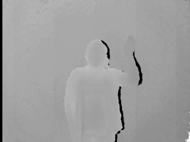
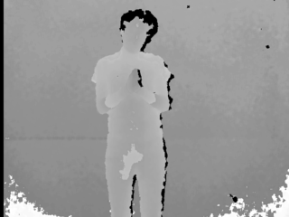
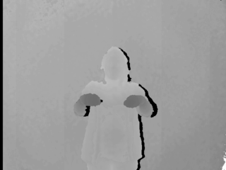

# VideoLSP10
The sign dataset for Peruvian Sign Language  was created with the objective of encouraging students and researchers to find better solutions to reduce the gap that exists between the deaf community and normal people, also to be used as training data for different learning models this dataset include 3 dataset called depth-VideoLSP10, join-VideoLSP10 and total-VideoLSP10

## Depth-VideoLSP10
This dataset contains only depth data divided into 14 classes, it was obtained by the Kinect v1 sensor at a resolution of 480x640 in closed environments.

|Nro| <big>Label</big> | <big>#Images </big>  |
|------|------ |------     |
|1|Hello   | 173       |  
|2|How    |210        | 
|3|Which  | 160       |
|4|Excuse | 60        |
|5|Where  | 185       |
|6|understand |152    | 
|7|These  |195        |
|8|Thank  |96         |
|9|Hello  | 152       |  
|10|Tomorrow | 99      |
|11| Name  | 135       |  
|12| Please | 230      |
|13|What   | 99        |  
|14|You    | 99        | 
|<b>TOTAL</b>|-|    <b>2045</b> |

<strong>Samples</strong>

  

      

          
      

      Hello
  

  

     

          
      

      Please
  

  

     

          
      

      How
  

<a href="https://drive.google.com/file/d/18f39Rc2x1jgF7nTZsIxZ59pqBWDxfqv2/view?usp=sharing">Download from Google drive</a>  

## Join-VideoLSP10
This dataset contains 1701 skeleton movements that is divided into 21 classes, each class has 81 sequences of movement where each frame of a movement is composed of 10 coordinates $ (x, y, z) $, the coordinates are points of union of the upper extremities of the human body including the head. The character "l" (left hand), "r" (right hand) and "b" (both hands) are prefixed to each tag as a reference to the hand that executes an action or movement. The movements are directed to certain directions (up, front, left, right, head, mouth and chest).

|Nro| <big>Label</big> | <big>#Videos </big>  |Nro| <big>Label</big> | <big>#Videos </big>  |
|------|------ |------     |------|------ |------       |
|1|l-up | 81               |11| r-right   | 81          |   
|2|r-up   |81              |12| b-right   | 81          |
|3|b-up  | 81              |13|l-head     | 81          | 
|4|l-front | 81            |14|r-head     | 81          | 
|5|r-front | 81            |15|b-head     | 81          | 
|6|b-front |81             |16|l-mouth    | 81          |  
|7|l-left  |81             |17|r-mouth    | 81          | 
|8|r-left |81              |18|b-mouth    | 81          | 
|9|b-left  | 81            |19|l-chest    | 81          |  
|10|l-right | 81           |20|r-chest    | 81          | 
| - |-   | -               |21|b-chest    | 81          |
| <b>TOTAL</b> |-   | -| - | - |    <b>1701</b> |

<strong>sample sequence</strong>

  

      

          
      

      b-up
  

<a href="https://drive.google.com/open?id=1ZP4vaRWslEalqQF8TsWiYI7DpiCOOyd1">Download from Google drive</a>  

## Total-VideoLSP10
This data set contains 10 Peruvian phrases most used in daily life and selected according to our criteria. Each phrase consists of 60 videos stored in RGB, DEPTH and SKELTON format which were captured in different environments with natural light, artificial and with different intensities, the number of frames in each phrase varies in a range of 17 to 197 depending on the complexity.
The data capture was made to 25 individuals who were taught each phrase before recording. The data was recorded using the <b>Kinect v1</b> sensor, for the RGB and DEPTH data it was recorded at a resolution of $480 \times 640$ and for the SKELETON data it was considered 10 points of union (hand right, wrist right, elbow right, shoulder right, head, shoulder center, shoulder left, elbow left, wrist left, hand left)

|Nro| <big>Label</big> | <big>#Videos </big>  |
|------|------ |------     |
|1|Help me             | 60       |  
|2|Please              |60        | 
|3|I am sorry          | 60       |
|4|¿What are your name? | 60        |
|5|I do not understand | 60       |
|6|¿Where do you live? |60    | 
|7|¿What are you do?  |60        |
|8|Hello, ¿How are you? |60         |
|9|Thank you           | 60      |
|10| See you tomorrow   | 60       |  
|-|<b>TOTAL</b>|    <b>600</b> |

<strong>sample sequence</strong>

  

      

          
      

      

          
      

      

          
      

      See you tomorrow 
  

<a href="https://drive.google.com/open?id=1CQTrvqExZJRW_9T-LeZYejSb32g-Yyke">Download from Google drive</a>  

## structure of the datasets
<ul>
    <li><strong>Depth-VideoLSP10</strong></li>
    The file depth.rar contains <b>n.xml</b> files which stores the depth information of a frame, inside the zip file there is a file <b>label.txt</b> which stores the tag which belongs a certain range of xml files.
    <li><strong>Join-VideoLSP10</strong></li>
    The join.rar file contains a set of folders with the same name as the tag to which they belong; each folder contains files in txt format that store the coordinates $(x, y, z)$ of each captured frame.
    <li><strong>Total-VideoLSP10</strong></li>
    The Total-VideoLSP10 dataset is divided into 14 files.rar, within each ".rar" there are folders with the same name to the phrase to which it belongs, each folder has a suffix "r" that indicates RGB data, "u" data SKELETON and " d "DEPTH data; inside the file <b>Data.part001.rar</b> exists a file <b>actionLabel.txt</b> that contains information of the user that performs the action, the frame where a sentence begins and the frame where it ends.

## Tools for preprocessing
Coming soon...

## License
 VideoLSP10 by <a xmlns:cc="http://creativecommons.org/ns#" href="https://github.com/videoLSP/VideoLSP10.git" property="cc:attributionName" rel="cc:attributionURL">Yuri Vladimir Huallpa Vargas</a> is licensed under a <a rel="license" href="http://creativecommons.org/licenses/by-nc/4.0/">Creative Commons Reconocimiento-NoComercial 4.0 Internacional License</a>. Creado a partir de la obra en <a xmlns:dct="http://purl.org/dc/terms/" href="https://github.com/videoLSP/VideoLSP10.git" rel="dct:source">https://github.com/videoLSP/VideoLSP10.git</a>.

If you use this work, you must comply with the following:
<ul>
    <li>Academic, educational or personal use is allowed without restrictions</li>
    <li>You must share any derivative works under the same license (ie, preprocessed versions of the dataset, subsets, supersets using other datasets).</li>
    <li>You must mention this website</li>
    <li>Commercial uses of the dataset are not allowed.</li>
</ul>

##  Contact

<b>Yuri Vladimir Huallpa Vargas</b> yurihuallpavargas@gmail.com
